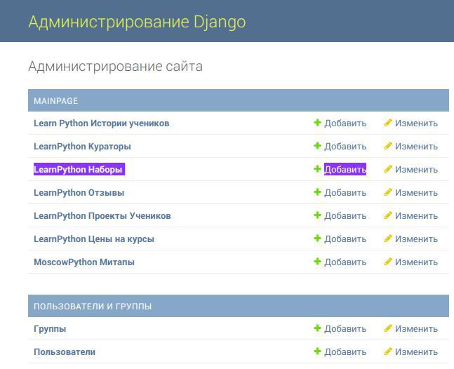
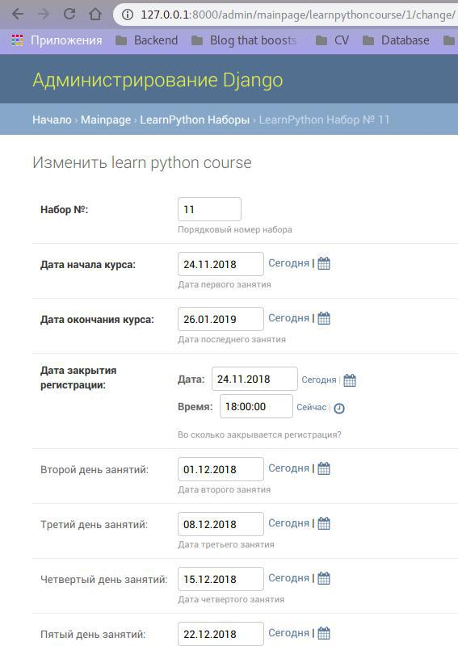

# To setup project localy

* Set up virtualenv
* Install requirements from `requirements.txt`
* Change settings in `settings.py`
* Go to sub directory `landing_page` in terminal `cd learnpython/landing_page`
* Run migrations `python manage.py migrate`
* Add admin user `python manage.py createsuperuser`
* Start the project with `python manage.py runserver`
* Login to the Admin panel in a browser `http://127.0.0.1:8000/admin/`

* Create enrollment.

* Login to Admin panel in a browser `http://127.0.0.1:8000/admin/`

# To deploy project

Check the `fabfile.py` if you need to alter deployment settings. Then install requirements from requitements-deploy.txt and run `fab deploy`
